Nama : Ischika Afrilla

NPM : 2306227955

Advance Programming - B
## Module 5 - Java Profiling
1. Test plan GUI for endpoints `/all-student-name`
   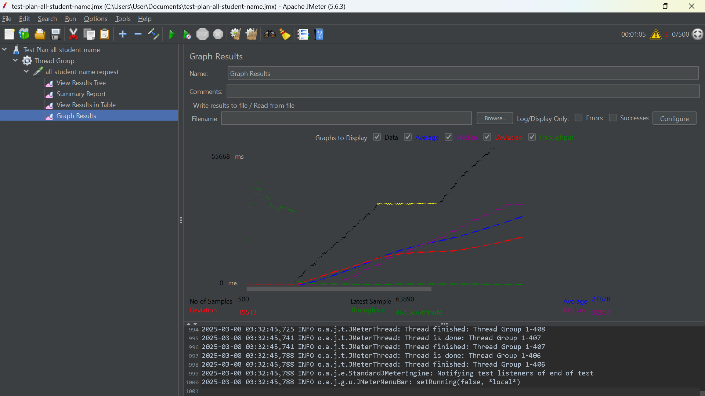
   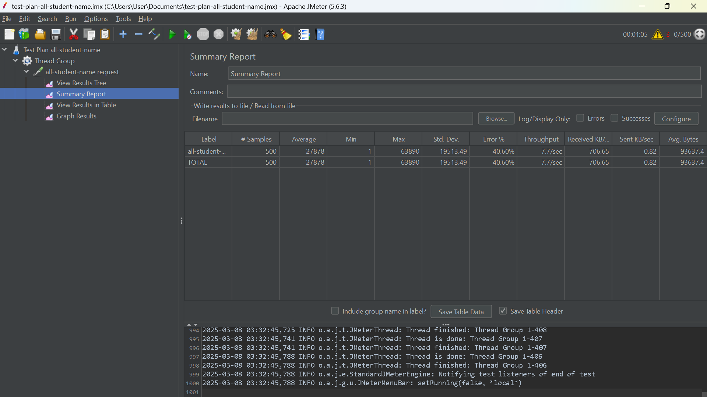
   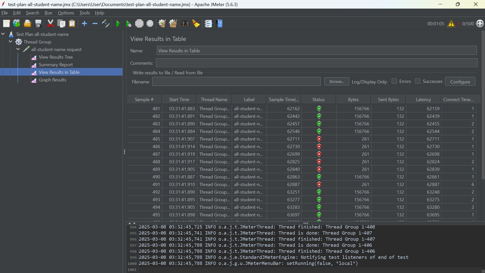
   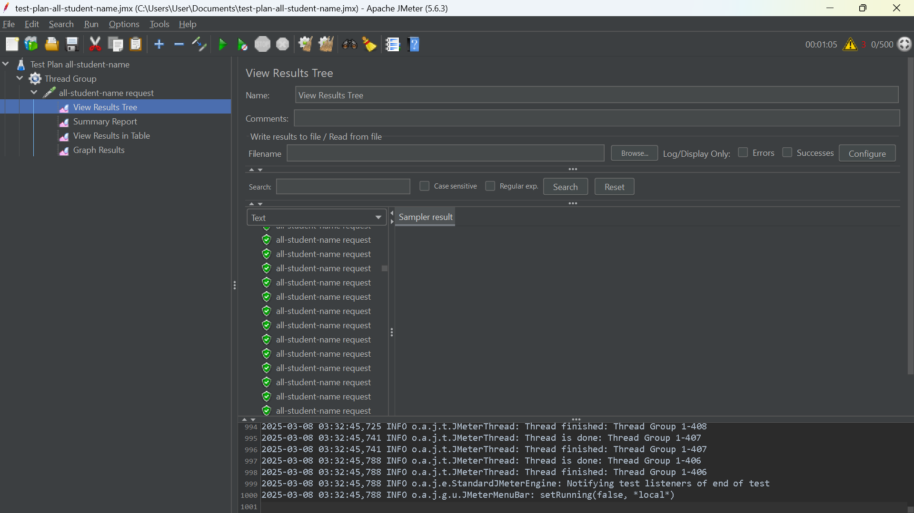
2. Test plan GUI for endpoints `/highest-gpa`
   
   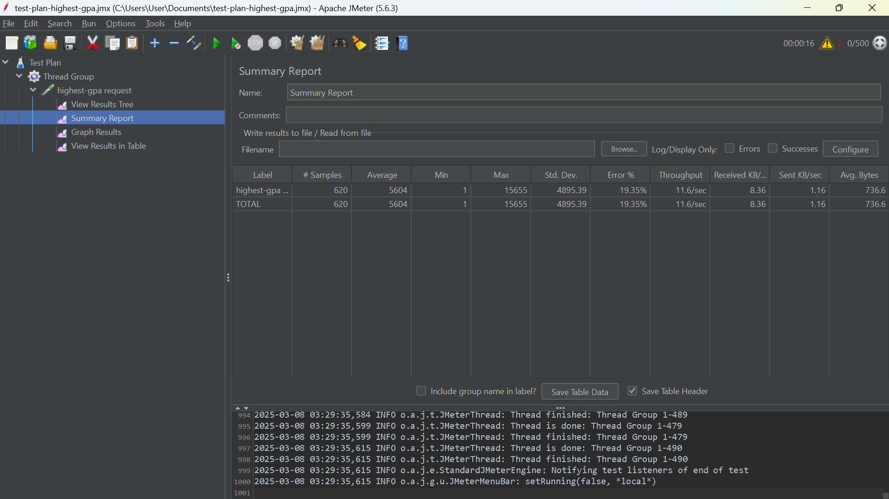
   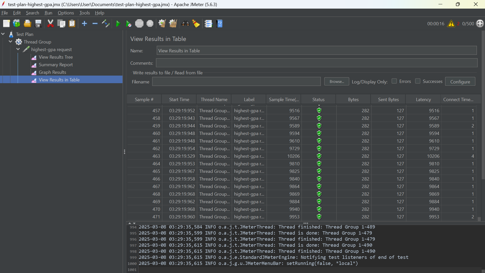
   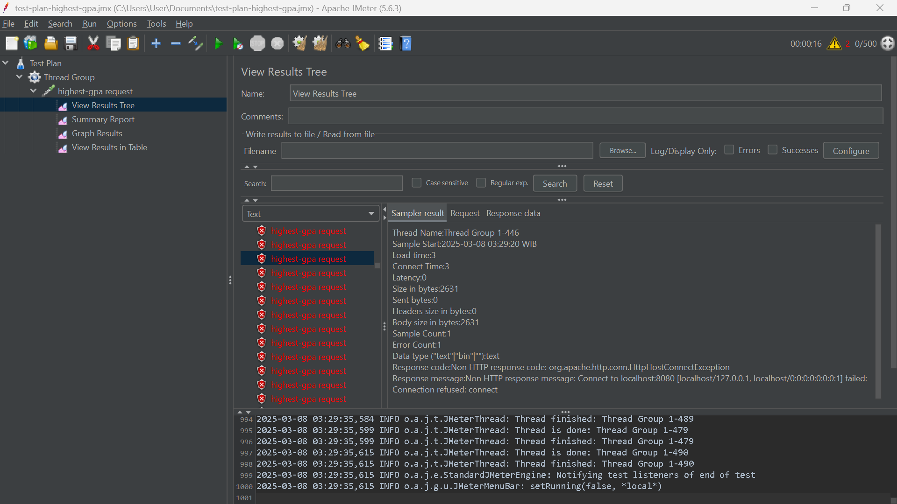
3. Test plan command line for endpoints `/all-student-name`
   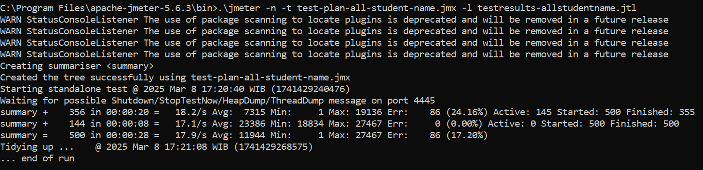
   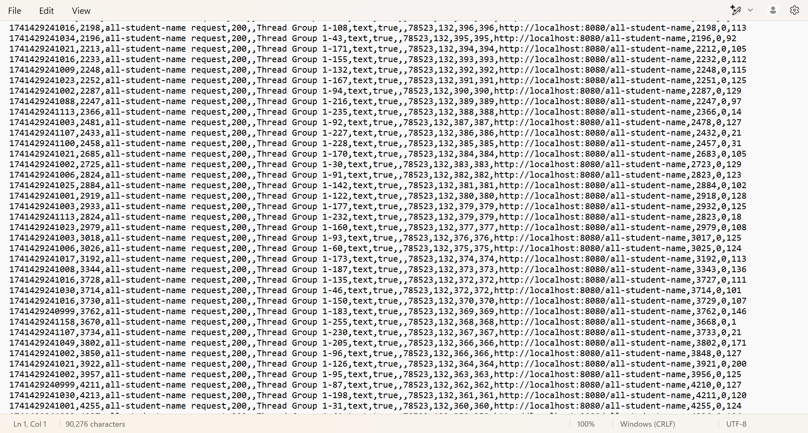
4. Test plan command line for endpoints `/highest-gpa`
   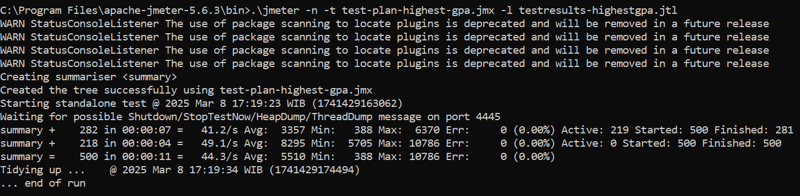
   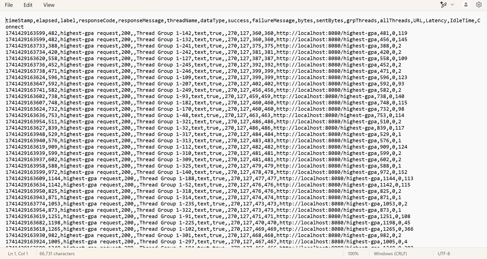

### After Refactoring
1. endpoints `/all-student`
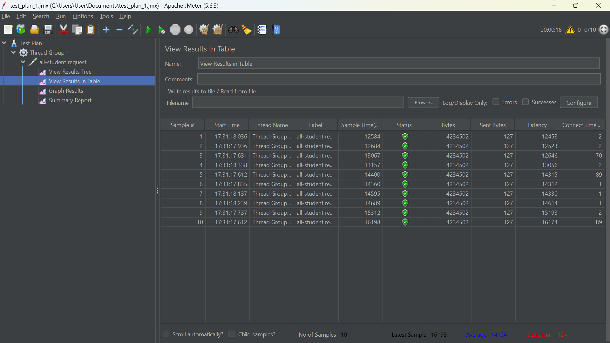
2. endpoints `/all-student-name`
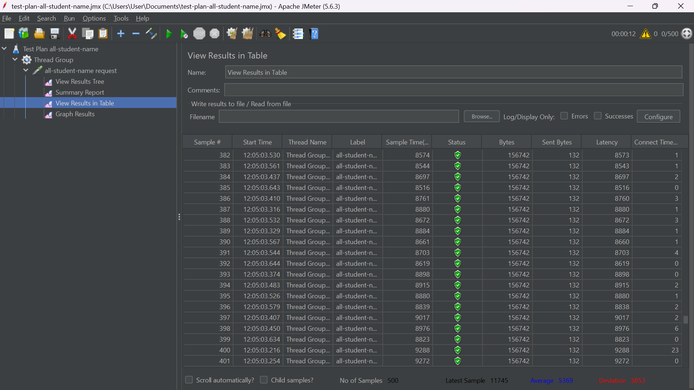
3. endpoints `/highest-gpa`
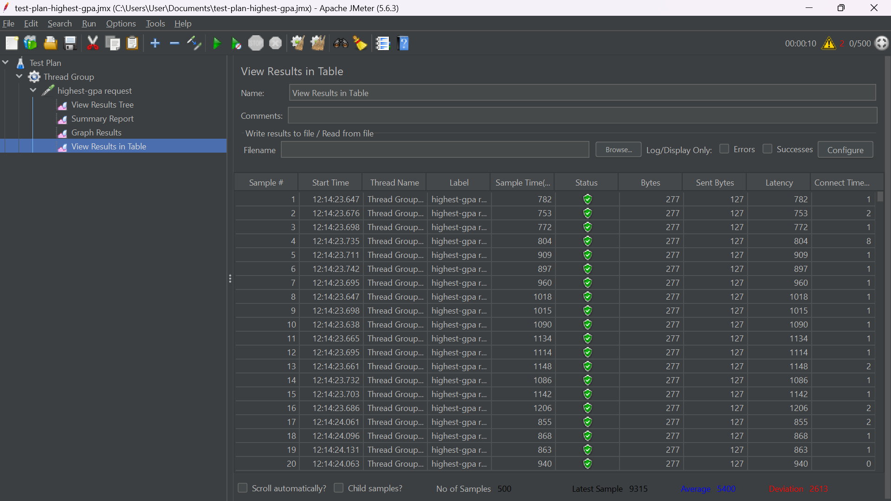

Berdasarkan data di atas, terlihat bahwa waktu eksekusi untuk endpoint `/all-student` mengalami penurunan lebih dari 20% pada sample time JMeter setelah dilakukannya refactoring. Penurunan signifikan juga terjadi pada endpoint `/all-student-name` dan `/highest-gpa`. Hal ini menunjukkan bahwa optimasi melalui refactoring fungsi memiliki dampak yang cukup besar terhadap nilai uji menggunakan JMeter.

### Reflection
1. What is the difference between the approach of performance testing with JMeter and profiling with IntelliJ Profiler in the context of optimizing application performance?
   JMeter digunakan untuk menguji performa aplikasi dari sisi beban dan respons, mensimulasikan banyak pengguna sekaligus. Sementara itu, IntelliJ Profiler digunakan untuk menganalisis performa aplikasi di tingkat kode, membantu menemukan bottleneck seperti penggunaan CPU atau memori yang berlebihan.

2. How does the profiling process help you in identifying and understanding the weak points in your application?
   Profiling membantu mengidentifikasi bagian kode yang tidak efisien, seperti metode yang terlalu lambat atau konsumsi sumber daya yang tinggi, sehingga dapat dilakukan optimasi yang lebih spesifik.

3. Do you think IntelliJ Profiler is effective in assisting you to analyze and identify bottlenecks in your application code?
   Ya, IntelliJ Profiler efektif dalam menganalisis bottleneck karena menyediakan informasi rinci tentang penggunaan CPU, memori, dan eksekusi metode, sehingga memudahkan pengembang dalam mengoptimalkan performa aplikasi.

4. What are the main challenges you face when conducting performance testing and profiling, and how do you overcome these challenges?

5. What are the main benefits you gain from using IntelliJ Profiler for profiling your application code?
   IntelliJ Profiler membantu menemukan bottleneck di level kode, memberikan wawasan tentang penggunaan CPU dan memori, serta memungkinkan optimasi yang lebih tepat pada bagian kode yang bermasalah.

6. How do you handle situations where the results from profiling with IntelliJ Profiler are not entirely consistent with findings from performance testing using JMeter?
   Perbedaan hasil dapat terjadi karena JMeter menguji beban aplikasi secara keseluruhan, sedangkan Profiling lebih berfokus pada kode internal. Untuk mengatasinya, saya menganalisis hasil keduanya secara bersamaan dan menyesuaikan dengan konteks pengujian untuk mendapatkan solusi yang tepat.

7. What strategies do you implement in optimizing application code after analyzing results from performance testing and profiling? How do you ensure the changes you make do not affect the application's functionality?
