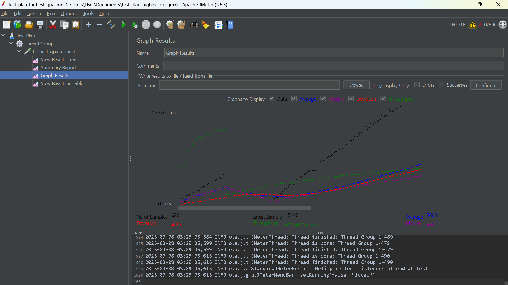

Nama : Ischika Afrilla

NPM : 2306227955

Advance Programming - B
## Module 5 - Java Profiling
1. Test plan GUI for endpoints `/all-student-name`
   
   
   
   
2. Test plan GUI for endpoints `/highest-gpa`
   
   
   
   
3. Test plan command line for endpoints `/all-student-name`
   
   
4. Test plan command line for endpoints `/highest-gpa`
   
   